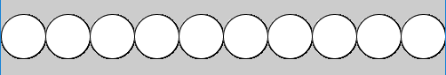
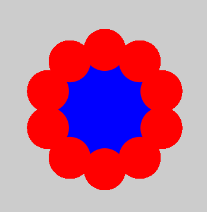
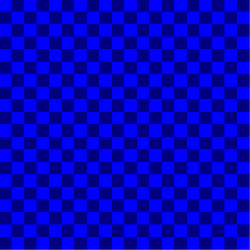

# DT508 Game Programming 2018-2019

Resources
---------
* [P5 Editor](http://editor.p5js.org)
* [The P5 Reference](https://p5js.org/reference/)
* [The Coding Train](https://www.youtube.com/channel/UCvjgXvBlbQiydffZU7m1_aw)
* [The Nature of Code](http://natureofcode.com/)
* [Games Fleadh](http://www.gamesfleadh.ie/)

## Past Exams
- [Supplemental Lab Test 2018](https://github.com/skooter500/GP-Autumn-Lab-Test-2018)
- [Lab Test 1 2016](https://github.com/skooter500/GP_Lab_Test_1)
- [Supplemental lab test 2 2016](https://github.com/skooter500/DT508-Lab-Test-Supplemental-2016)
- [End of year lab test 2016 Solution](https://github.com/skooter500/DT508-Lab-Test-Solution-2016)
- [Lab Test 1 2015](https://github.com/skooter500/dt508_2015_labtest1)

## Contact the lecturer
* Email: bryan.duggan@dit.ie
* Twitter: [@skooter500](http://twitter.com/skooter500)
* [My website & other ways to contact me](http://bryanduggan.org)

## Assignments

- 19 November 2018 Lab Test 20%
- 3 December 2018 Assignment 1 submission 20%
- Assignment 2 - 30% - Due TBC 
- End of Year lab test - 30% - TBC 

[Assignment rubric & description](assignments.md)

# Week 6
## Lecture - Functions & recursion

## Lab
### Learning Outcomes
- Learn how to use the for loop and the while loop to generate sequences of numbers
- Develop computational thinking skills

Start by writing code in the setup function to do the following. Write these using both for loops and while loops:

- A loop that prints the numbers from 0-20
- A loop that prints all the odd numbers between 0-200
- A loop that prints the numbers from 20-0 backwards
- A loop that prints the numbers from 500-450 going backwards in steps of 5 

You can write:

```colorMode(HSB);```

In your setup function

Use a for loop, rect and HSB colours to draw this:


Use sin and cos to draw this:


Use a loop and the HSB colour space


Use a nested loop to draw this:


# Week 5
## Lecture - More loops
- [Flowers sketch](https://editor.p5js.org/skooter500/sketches/HkoRo7MoX)
- [Drawing a regular polygon](https://editor.p5js.org/skooter500/sketches/r1c-vxzs7)
- [Printing the fibonachi sequence]()

## Lab
### Learning Outcomes
- Practice generating lots of different shapes with loops in processing
- Be creative and make something beautiful in code

Draw the following shapes. Use variables and loops in your solutions!

I'ts best to spend some time thinking about the variables and how they are changing before writing code:

These require ONE loop:


This shape draws lines from the sides that all meet in the middle. This can be done using one loop, but is better with two:


This sketch always draws 10 equally sized circles across the screen. This should work no matter what you set the screen size to. You should also declare a variable to hold the number of circles to draw so that if you change this number, the sketch should still work:



This sketch places circles around the outside of a bigger circle to make a flower pattern. Once you figure this out, you can modify it to do something cool with colours:



This sketch prints the numbers of the clock around in a circle:


This sketch requires you to put one loop inside another and also use a boolean variable, though there are other ways to do this:



This is what it looks like when all the above code is in one sketch:


Try and draw this using ONE for loop:


Write a sketch that can draw regular polygons like squares, pentagons, octogons etc:


Write a sketch that can draw stars like these:


Google Sacred Geometry and see if you can code some of the images!

# Week 4
## Lecture
- Loops
- [Loops examples](https://editor.p5js.org/skooter500/sketches/SJ6Q-lt9m)

[](https://www.youtube.com/watch?v=cnRD9o6odjk)

## Lab

## Part 1

Try and make this sketch that draws a face that starts in the center of the screen and moves to the edge of the screen and then follows around the outside of the screen

[](https://www.youtube.com/watch?v=lA-3AROmMiE)

## Part 2

See how much of this sketch you can make today:

[](https://www.youtube.com/watch?v=FTHyQDovfsw)

What is happening:

The face represents the player. The player can move left and right by pressing the left and right arrow keys. The player can only move upwards using the up arrow key whenever they are over the ladder. There is no requirement for down. When the player reaches the key, the player changes to a happy face and the key disappears.

In your solution, you should use variables, the if statement. 

# Part 3 - Bugzap

Try and program this silly game. Best to start getting the core game working and then get the splash screen and game over screen working

[](https://www.youtube.com/watch?v=1If-kPm6MzM)

# Week 3 - Selection
## Lecture

- [If Statement sketch](https://editor.p5js.org/skooter500/sketches/B1HVJ6JqQ)

[](https://www.youtube.com/watch?v=1Osb_iGDdjk)

[](https://www.youtube.com/watch?v=r2S7j54I68c)

[](https://www.youtube.com/watch?v=UvSjtiW-RH8)

## Lab
### Learning Outcomes
- Use numeric variables in a sketch
- Use operatorts on variables
- Use trigonometry
- Make beautiful things

### Part 1 - Making your own variables (this was part 2 from last week)

Make this:

[](https://www.youtube.com/watch?v=uvPVGiU-bn4)

What is happening:

- The ground takes up half the window size
- The spaceship is 100 pixels wide and is *centered* around the mouse position.
- The person starts at the right side of the screen and moved from right to left

Use variables wherever practical in your sketch and calculate positions and sizes relative to these variables.

Bonus!

There are few things you can try (but you will probably have to read ahead and figure out how the if statement works)

- Come up with a more beautiful looking spaceship and person
- Change the colours of everything
- Make a car that drives from left to right
- When the person reaches the left side of the screen, he should switch direction
- Make the lights on the spaceship flash different colours

### Part 2 - Trigonometry

A person flying a kite has released 176m of string. The string makes an angle of 27° with the ground. How high is the kite? How far away is the kite horizontally?
Write a p5 sketch to draw and solve the problem.
  - Solve the problem on paper first
  - Make variables for stringLen, theta, kHeight, kDist and any other variables you need
  - Assign the values that you know to the variables
  - Write code to calculate the kith height and horizontal distance values
  - Write code to draw the scenario


You can use the function [text](https://p5js.org/reference/#/p5/text) to print text to the screen and [nf](https://p5js.org/reference/#/p5/nf) to format a number to a certain number of dp's. For example ```text("Price: " + nf(p, 10, 2), 10, 50)```. You can look these functions up in the P5.js reference.

### Part 3 - Spiral Jam

Check out the [sketch we wrote last week which draws a spiral](https://editor.p5js.org/skooter500/sketches/ByGsKtLFX). Experiment with the sketch and see what kind of crazy beautiful spirals you can make. Use variables for colourscreate colour gradients, use different shapes etc etc.


# Week 2
## Lecture - Using variables. Trigonometry & spirals
- [Spiral sketch](https://editor.p5js.org/skooter500/sketches/ByGsKtLFX)
- [Using variables](https://editor.p5js.org/skooter500/sketches/Skz6etItm)
- [Solution to the lab](https://editor.p5js.org/skooter500/sketches/rJiCWHUKm)

[](https://www.youtube.com/watch?v=Bn_B3T_Vbxs)

[](https://www.youtube.com/watch?v=RnS0YNuLfQQ)

## Lab

### Learning Outcomes
- Practice drawing using P5
- Use operators with variables

# Part 1 - Using the built in variables

Here is a youtube video of 4 sketches you can program today:

[](https://www.youtube.com/watch?v=kPOFqXsLLeo)

In your solution use the following processing functions:
- fill
- rect
- ellipse
- background
- stroke
- noStroke

And the mouseX and mouseY varibles. You can also use the + - * / operators
# Week 1

## Lecture
- [The contract for this course](https://1drv.ms/w/s!Ak7y2552PWCrjPYXt8HlWl1T1cg5Og)

## Lab

### Learning Outcomes
- Enroll on Google Classroom
- Setup an account on editor.p5.org
- Know good online resourses
- Check out previosu student work
- Learn how to draw using p5
- Become familiar with writing and running sketches

### Instructions
- Log onto [Google Classroom](http://classroom.google.com) and enroll on the module okbrtfr.
- Create an account at the [P5 Editor](http://editor.p5js.org)
- Check out [the P5 reference](https://p5js.org/reference/)
- Check out [The Coding Train](https://www.youtube.com/channel/UCvjgXvBlbQiydffZU7m1_aw)
- Check out [these Sci-Fi user interfaces made by last years OOP students](https://www.youtube.com/playlist?list=PL1n0B6z4e_E5RZYrubD2pcxq0qzGy-3vr)
- Check out [these music visualisers made in Processing by previous programming students](https://www.youtube.com/watch?v=cW8s5i9dmqA&list=PL1n0B6z4e_E6jErrS0ScSCaVrN7KV729x)
- If you are curious, check out [some of my creature videos](https://www.youtube.com/watch?v=cW8s5i9dmqA&list=PL1n0B6z4e_E6jErrS0ScSCaVrN7KV729x)
- Look up the following methods in the p5 reference to make sure you are clear about the syntax and parameters:
    - noStroke
    - noFill
    - line
    - ellipse
    - rect
    - background
    - stroke
    - fill
    - size
    - arc
    - triangle

Write sketches to draw the following shapes:


